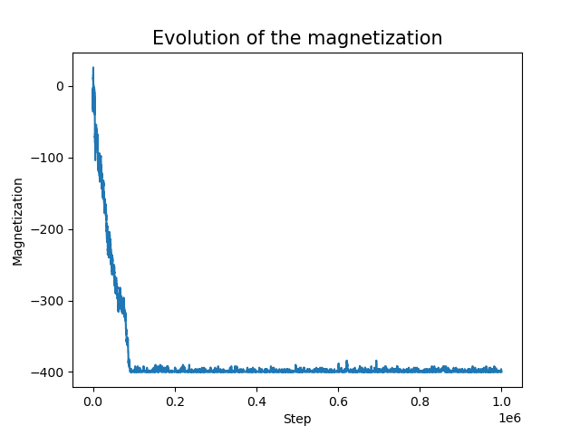
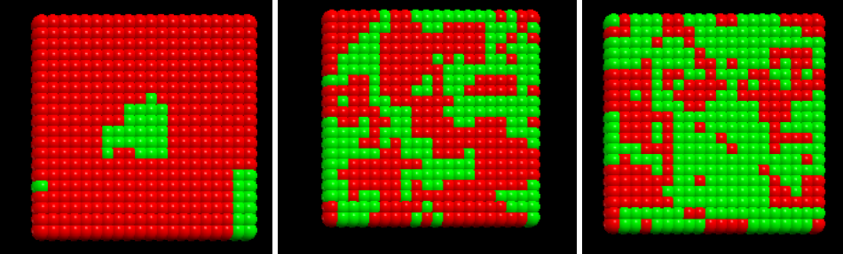
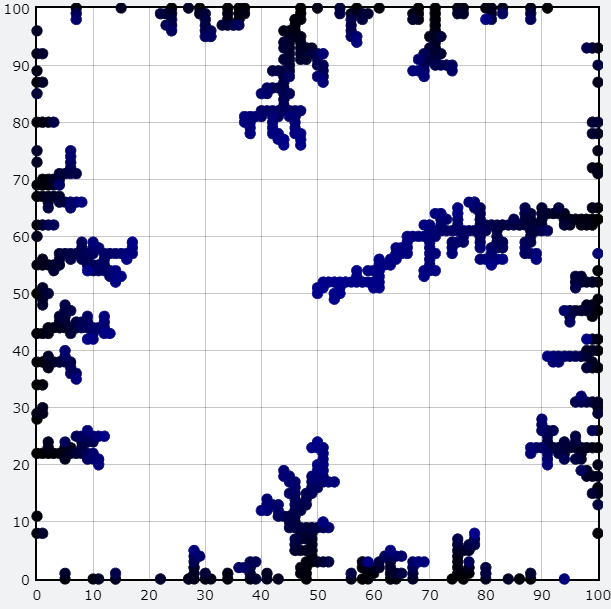
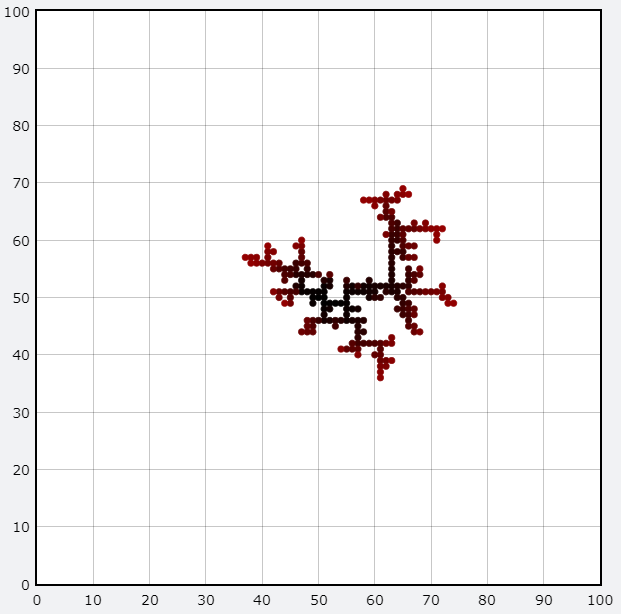
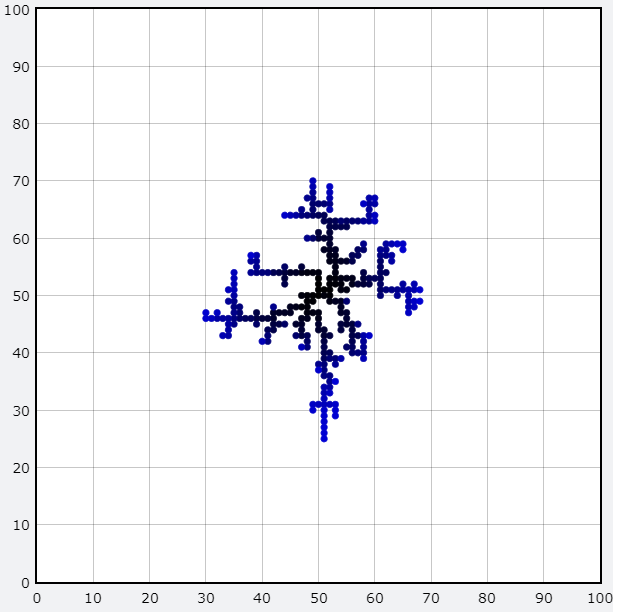

# Chapter 10:

## Exercise 10.9:
The <b>Ising model</b> is a theoretical model to describe the magnetization of a material. It considers that the material is made up of magnetic dipoles (spins) that can interact with each other and with an external magnetic field. In this exercise, I performed a <b>Markov chain Monte Carlo simulation</b> of the Ising model on a square lattice of 20x20 spins. In each step of the simulation, I sorted a spin to flip its sign and calculate the energy difference. Then, I used a <b>Metropolis-style algorithm</b> to decide if the transition should be accepted. With this program, it was possible to make plots of the evolution of the energy and magnetization of the system. After some time, the system reaches an equilibrium situation. For instance, the evolution of the magnetization in a run of the algorithm with one million steps can be seen below:

  
   

I also made an <b>animation</b> of the evolution of the spin-lattice using the <b>vpython</b> library (file 10.9e.ipynb). In it, red circles represent spins with value +1, while green circles represent spins with value -1. With these simulations, it was possible to note a phase transition of the system above some temperature. There was a spontaneous magnetization for low temperatures, while for high temperatures, the mean magnetization was zero. Below, there are three frames of the animation, each one for a different temperature.
  

  
   

## Exercise 10.13:
In this exercise, I constructed an algorithm to reproduce the <b>diffusion-limited aggregation (DLA)</b> model. I considered two versions of the DLA model. In the first version (files 10.13a.ipynb and 10.13b.ipynb), a particle starts at the center of a square lattice and performs a <b>random walk</b> until it reaches the walls of the lattice, at which point it sticks to the edge. Then, a second particle starts at the center and performs a random walk until it sticks to the edges or to the other particle. Then, a third particle starts, and so on. The process stops when a particle is anchored in the center of the lattice. An animation of the evolution of the system was made using the <b>vpython</b> library. Below, there is a frame of the animation (when the process has reached its end):

  
   

In the second version (file 10.13c.ipynb), the lattice starts with a particle fixed in the center. Then, another particle starts at a random point and performs a random walk until it reaches the particle in the center (it does not get anchored in the walls). Then, a second particle starts and performs a random walk until it gets anchored to one of the other particles. And so on. I also made an animation of this case using the vpython library. Below, there are two frames of it (of two different runs):
  

  
   

  
   

