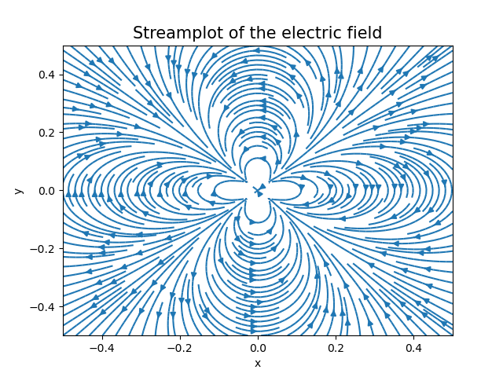

# Chapter 5 - Integrals and derivatives

## Exercise 5.17:
The aim of this exercise is to calculate the gamma function, which is defined by
$$ \Gamma (a) = \int_{0}^{\infty} x^{a-1}e^{-x}  dx. $$
But to calculate this integral is not so straightforward. First, the range of the integral is from 0 to $\infty$, and we have to change that to a finite range from 0 to 1.
Also, most of the area under the function curve is concentrated under a peak and becomes negligible far from it, so we need to focus our calculation around this region.
To deal with this problems, the following change of variables is done:
$$ z = \frac{x}{x + a - 1} $$
This will change the range to $[0,1]$ and place the peak in the middle of this interval, i.e. $z = \frac{1}{2}$.
But there is one last problem that must be dealt: the factor $x^{a-1}$ can become very large and the factor $e^{-x}$ can become very small, and these can cause overflow or underflow. To deal with this, I wrote the integrand as $x^{a-1}e^{-x} = e^{(a-1)\log{x} - x}$. The integration method chosen was <b>gaussian quadrature</b>.

## Exercise 5.21:
In this exercise, we have to use <b>numerical integration and derivation methods</b> to calculate the electric potential and field of a given distribution of charges. For instance, the charge distribution in item c) (file 5.21c.py) is given by
$$\sigma (x,y) = q_0 \sin \frac{2 \pi x}{L} \sin \frac{2 \pi y}{L}. $$
To calculate the potential function  $ V(x,y) $, we have to evaluate the following double integral for each value of $(x,y)$:

$$V(x,y) = \frac{1}{4 \pi \epsilon_0} \iint \frac{\sigma(x,y)}{\sqrt{(x - x^{\prime})^2 + (y - y^{\prime})^2}}dx^{\prime}dy^{\prime}. $$
The integration method chosen was <b>gaussian quadrature</b>. The next step was to take the gradient (derivative) of the function $V(x,y)$ to obtain the electric field $E(x,y)$. I used the **numpy** function *gradient*, which implements central differences in interior points and backward or forward differences in boundary points. The image below, produced using the function *streamplot* of **matplotlib**, shows the electric field for this charge distribution:

  
   

## Exercise 5.23:
In this exercise, it is given information about the altitude in a bi-dimension surface, i.e. it is given a function $z=w(x,y)$ for each point in a plane. Also, we are given information about the illumination intensity that is arriving at the surface. With these data, we can make a density plot to visualize the illuminated surface. The illumination intensity at each point of the surface is given by:
$$ I = \frac{a_{x}(\partial w / \partial x)+a_{y}(\partial w / \partial y)-a_{z}}{\sqrt{(\partial w / \partial x)^{2}+(\partial w / \partial y)^{2}+1}} ,$$
where $\vec{a} = (a_{x},a_{y},a_{z})$ is a vector representing the intensity and direction of light in a specific point. See 'Exercise 5.23: Image processing and the STM' in '/references/exercises5.pdf' for more details. To calculate $I$, it is necessary to <b>calculate numerically the partial derivatives</b> of $w$. It was used central differences in interior points and backward or forward differences in boundary points. Below, we have the result of the program when the altitude $z = w(x,y)$ represents data about the surface of the Earth:

  
   

