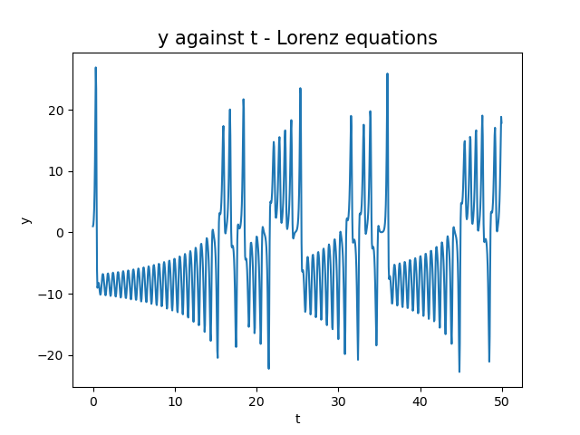
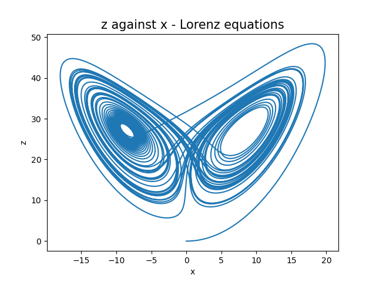
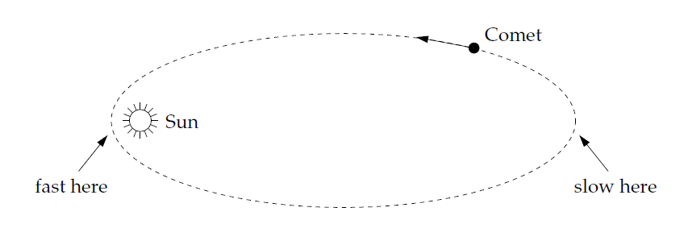
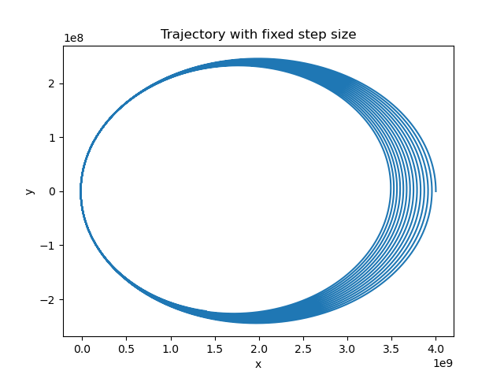
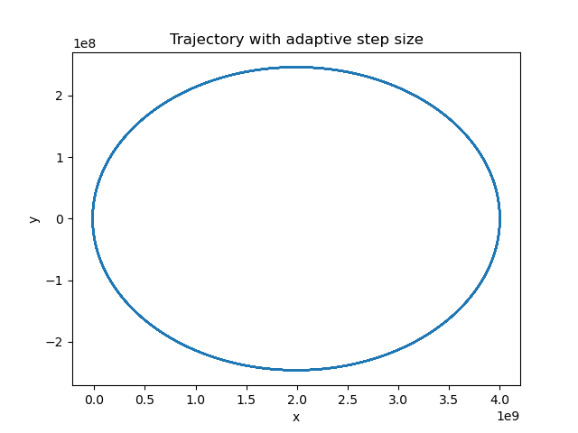
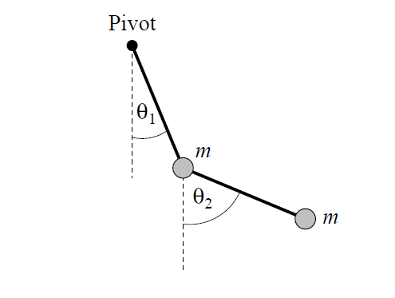
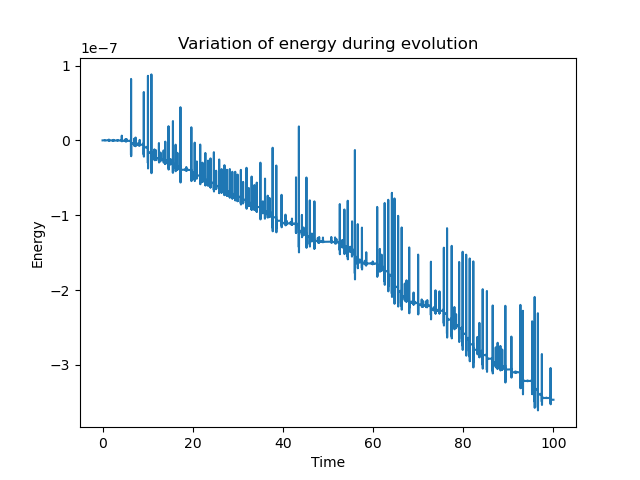
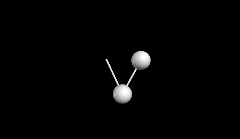

# Chapter 8 - Ordinary differential equations

## Exercise 8.3:
The Lorenz equations were one of the first incontrovertible examples of deterministic chaos, which is the occurrence of apparently random motion
even though there is no randomness built into the equations. They are given by the following set of differential equations:
$$ \frac{\mathrm{d} x}{\mathrm{~d} t}=\sigma(y-x), \quad \frac{\mathrm{d} y}{\mathrm{~d} t}=r x-y-x z, \quad \frac{\mathrm{d} z}{\mathrm{~d} t}=x y-b z, $$
with $\sigma=10$, $r=28$, and $b= \frac{8}{3}$ in this exercise. I used the **fourth-order Runge-Kutta** method to solve these equations with initial conditions $(x,y,z) = (0,1,0)$. In the images below, it is shown the graphs of $y$ against $t$ and of $z$ againts $x$. This last one is the famous "strange attractor" of Lorenz equations.

  
   

  
   

  

## Exercise 8.10:
In this exercise, I had to calculate numerically the orbit of a comet around the sun. This is a situation which an <b>adaptive step size method</b> is useful, since the comet travels slowly when it is far from the sun and hence we can use large step sizes in this region, while the comet travels faster near the sun and small step sizes are needed.

  
   

The trajetory of the comet is described by the Newtonian gravitational force and Newton's second law:
$$\frac{\mathrm{d}^{2} x}{\mathrm{~d} t^{2}}=-G M \frac{x}{(x^2 + y^2)^{\frac{3}{2}}}, \quad \frac{\mathrm{d}^{2} y}{\mathrm{~d} t^{2}}=-G M \frac{y}{(x^2 + y^2)^{\frac{3}{2}}}.$$
This is a system of second order ordinary differential equations. To solve it, we transform it in a system of 4 first order differential equations by using the substitutions $u = \frac{\mathrm{d} x}{\mathrm{~d} t}$ and $w = \frac{\mathrm{d} y}{\mathrm{~d} t}$, getting the following system:
$$\frac{\mathrm{d} u}{\mathrm{~d} t} = -G M \frac{x}{(x^2 + y^2)^{\frac{3}{2}}}, \quad \frac{\mathrm{d} x}{\mathrm{~d} t} = u$$
$$\frac{\mathrm{d} w}{\mathrm{~d} t} = -G M \frac{y}{(x^2 + y^2)^{\frac{3}{2}}}, \quad \frac{\mathrm{d} y}{\mathrm{~d} t} = w$$
First, I implemented the <b>fourth-order Runge-Kutta</b> method with a fixed step size (file 8.10b.py). After some complete orbits, it is possible to note the erros in the trajetory, and for a long time the trajetory diverges completely. This is shown in the image below:

  
   

Then, I implemented the <b>fourth-order Runge-Kutta with adaptive step size</b>. In this method, we choose a target error in each step and the step size is updated to reach for this error. So if in a step the error is bigger than desired, we repeat the calculations with a smaller step size. But if the error is smaller than desired, we perform the next step with a bigger step size. With this method, it was possible to reach a much better precision with much less time compared to the method with a fixed step size. So the method with adaptive step size was superior. The image below shows the trajectory computed at the same instant as in the image above (and it used less computational time).

  
   

## Exercise 8.15:
Here, we have to solve the equations of motion of a *double pendulum*. This system is described by the coordinates $\theta_1 \text{ and } \theta_2$, as in the image below:

  
   

The motion is described by two second order ordinary differential equations (see 'Exercise 8.15: The double pendulum' in '/references/exercises8.pdf' for more details), and we transform it into a system of four first order differential equations. After some algebra, we have the following equations:
$$\dot{\omega}_1=-\frac{\omega_1^2 \sin \left(2 \theta_1-2 \theta_2\right)+2 \omega_2^2 \sin \left(\theta_1-\theta_2\right)+(g / \ell)\left[\sin \left(\theta_1-2 \theta_2\right)+3 \sin \theta_1\right]}{3-\cos \left(2 \theta_1-2 \theta_2\right)} $$
$$\dot{\omega}_2=\frac{4 \omega_1^2 \sin \left(\theta_1-\theta_2\right)+\omega_2^2 \sin \left(2 \theta_1-2 \theta_2\right)+2(g / \ell)\left[\sin \left(2 \theta_1-\theta_2\right)-\sin \theta_2\right]}{3-\cos \left(2 \theta_1-2 \theta_2\right)} . $$
$$\dot{\theta}_1=\omega_1, \quad \dot{\theta}_2=\omega_2.$$
To solve it, we used <b>fourth-order Runge-Kutta</b> method. This is a conservative system, which means that with an exact solution its energy should be constant over time. I monitored the evolution of the energy over time and chose a step for the Runge-Kutta such that the variation of energy was of the order of $10^{-7}$ Joules. Below is shown the variation of the energy over time:

  
   

I also made an animation of the double pendulum motion using the library <b>vpython</b> (file 8_15.py). Below, there is a print of one frame of the animation.

  
   

